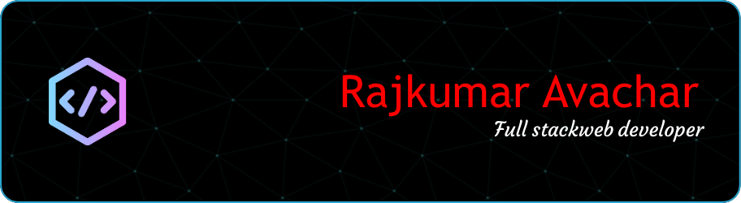

  

<h1 align="center">Hi 👋, I'm Rajkumar Avachar</h1>
<h3 align="center">Aspiring full stack web developer.</h3>

  

<h2>🚀About Me</h2>

  

    I am an aspiring full-stack developer, passionate about building responsive and scalable web applications. I’m currently diving deep into the MERN stack and exploring best practices in modern web development.
  

  <ul>
    <li>🌱 I’m currently learning <strong>MERN Stack</strong></li>
    <li>📫 How to reach me: <strong>rajavachar59@gmail.com</strong></li>
  </ul>

  

 
<h3 align="left">Languages and Tools:</h3>

  
  &nbsp;
  
  &nbsp;
  
  &nbsp;
  
  &nbsp;
  
  &nbsp;
  
  &nbsp;
  

  

  

  

  

